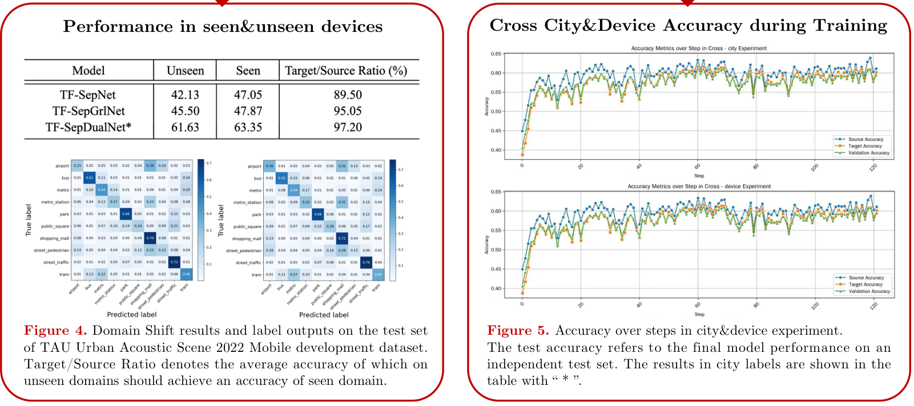
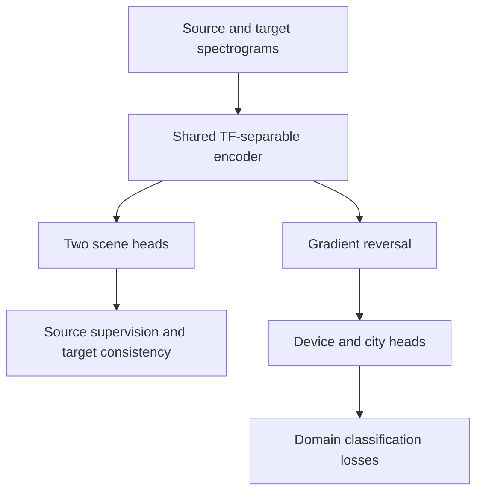
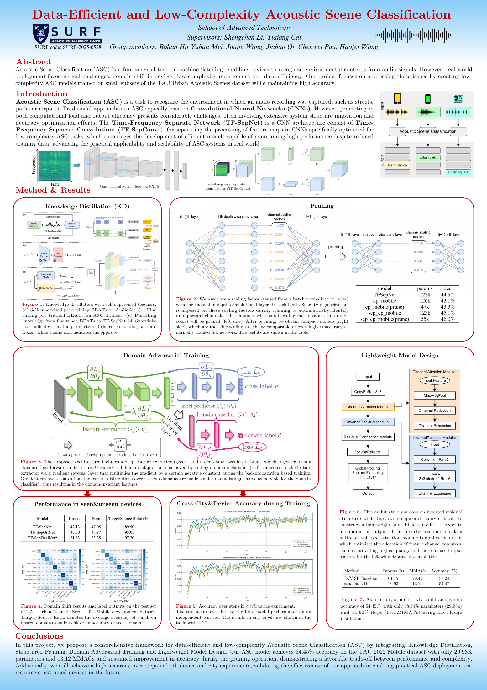

# TF-SepDualNet
### Domain adaptation for acoustic scene classification

**SURF 2025 · Xi'an Jiaotong-Liverpool University · Audio machine learning**

[Project poster](docs/poster/SURF-2025-0528.pdf) · [Reported results](#reported-results) · [Implementation notes](docs/IMPLEMENTATION_NOTES.md) · [Getting started](#getting-started)

TF-SepDualNet explores acoustic scene classification under recording-device and city domain shift. It extends a TF-SepNet-based feature extractor with **two scene-classification heads** and **device/city domain-adversarial heads**.

This repository presents **Jiahao Qi's TF-SepDualNet implementation** within the SURF-2025-0528 team project, *Data-Efficient and Low-Complexity Acoustic Scene Classification*. The training framework builds on [Easy DCASE Task 1](https://github.com/yqcai888/easy_dcase_task1); the upstream TF-SepNet, BEATs, and training utilities are credited separately below.

## Research focus

An acoustic scene classifier predicts the environment of a recording, such as an airport, park, or street. Differences between recording devices and cities can shift the audio distribution and reduce transfer performance.

This project investigates a shared time–frequency representation with three complementary training signals:

- **Scene supervision:** two scene heads learn from labelled source recordings.
- **Domain-adversarial learning:** device and city heads operate through gradient reversal.
- **Target-head consistency:** an L1 term encourages agreement between the two scene heads on target recordings.

At inference, the model averages the two scene-head logits. “Dual” refers to the two scene heads, not two audio channels.

## Reported results

The following values are transcribed from **Figure 4 of the original 2025 team poster**. The row names, asterisk, column labels, and numbers are preserved.

| Model | Unseen (%) | Seen (%) | Target/Source Ratio (%) |
| --- | ---: | ---: | ---: |
| TF-SepNet | 42.13 | 47.05 | 89.50 |
| TF-SepGrlNet | 45.50 | 47.87 | 95.05 |
| **TF-SepDualNet\*** | **61.63** | **63.35** | **97.20** |

\* The poster's Figure 5 caption identifies starred results as the **city-label experiment**. The original table is headed “seen & unseen devices”; both the heading and annotation are retained in the source rather than silently reinterpreted.

The poster reports higher seen/unseen values and a higher target/source ratio for its TF-SepDualNet row. These are **historical reported results**, not new measurements or a newly verified controlled comparison. This documentation update does not rerun experiments. The current repository's validation and test manifests are identical; their relationship to the original poster runs remains to be checked. See [evaluation provenance](docs/IMPLEMENTATION_NOTES.md#evaluation-provenance) before interpreting the table as an independent-test result.

[](docs/poster/SURF-2025-0528.pdf)

*Unaltered rendering of the poster's Figures 4–5 region. Open the PDF for the complete poster, authorship, and surrounding context.*

## Model overview



| Part | Implementation |
| --- | --- |
| Backbone and prediction heads | [TFSepDualNet in model/backbones.py](model/backbones.py) |
| Gradient reversal | [model/function.py](model/function.py) |
| Losses and training/validation/test steps | [LitAscWithDomainAdaptationSystem](model/lit_asc.py) |
| Source/target sample pairing | [data/data_module.py](data/data_module.py) |
| Group validation metrics | [util/callback.py](util/callback.py) |

The implementation combines source scene cross-entropy, device/city domain cross-entropy, and target-head L1 consistency. The consistency term uses **raw logits**; the current training step is joint loss minimization, not an alternating maximum-classifier-discrepancy procedure.

## Project poster

**Data-Efficient and Low-Complexity Acoustic Scene Classification**  
SURF-2025-0528 · School of Advanced Technology, XJTLU  
**Supervisors:** Shengchen Li and Yiqiang Cai  
**Team:** Bohan Hu, Yuhan Mei, Junjie Wang, Jiahao Qi, Chenwei Pan, and Haofei Wang

[Open the original poster (PDF)](docs/poster/SURF-2025-0528.pdf)

<details>
<summary>View the full poster</summary>

[](docs/poster/SURF-2025-0528.pdf)

</details>

The poster covers knowledge distillation, pruning, domain-adversarial training, and lightweight model design across the team project. This repository focuses on the **TF-SepDualNet/domain-adaptation implementation**. The poster's lightweight `student_KD` parameter and MAC counts are not TF-SepDualNet measurements.

## Getting started

The experiment code and configuration are preserved in this presentation update. A clean-environment reproduction has not been run for this revision.

### 1. Set up the project

```bash
git clone https://github.com/AlbertXia-herald/TF-SepDualnet-used-in-acoustic-scene-classification.git
cd TF-SepDualnet-used-in-acoustic-scene-classification
```

Use a Python environment with compatible PyTorch and torchaudio installations, then install the listed dependencies:

```bash
pip install -r requirements.txt
```

Dependencies are currently unpinned; see [implementation notes](docs/IMPLEMENTATION_NOTES.md) for the reproduction status.

### 2. Prepare data when available

Obtain the [TAU Urban Acoustic Scenes 2022 Mobile development dataset](https://zenodo.org/records/6337421) and the impulse-response files required by the selected augmentation. Configure:

- `data.init_args.audio_dir`: extracted audio dataset root.
- `data.init_args.meta_dir`: metadata directory.
- `model.init_args.data_augmentation.dir_aug.init_args.path_ir`: impulse-response directory.

The checked-in TF-SepDualNet configurations use 32 kHz audio, 512 mel bins, 10 scene classes, 9 device domains, 10 city domains, and 150 training epochs. Review the [evaluation provenance notes](docs/IMPLEMENTATION_NOTES.md#evaluation-provenance) before collecting new reportable results.

### 3. Training entry point

```bash
python main.py fit --config config/tfsepdualnet_td.yaml
```

| Configuration | Configured differences |
| --- | --- |
| [tfsepdualnet_train.yaml](config/tfsepdualnet_train.yaml) | Device domain label; TensorBoard logging |
| [tfsepdualnet_td.yaml](config/tfsepdualnet_td.yaml) | Device domain label; TensorBoard/CSV logging and group callback |
| [tfsepdualnet_tc.yaml](config/tfsepdualnet_tc.yaml) | City domain label; TensorBoard/CSV logging and group callback |

Both domain losses remain active in the current training step. These filenames alone do not establish device-only/city-only training ablations.

### 4. Inspect existing logs

```bash
tensorboard --logdir log
python main.py --analyze
```

The analysis command requires existing CSV logs. It is not needed to browse the archived poster and does not independently validate its results.

## Repository guide

| Path | Purpose |
| --- | --- |
| `model/` | TF-SepDualNet, baseline backbones, classifiers, and training systems |
| `config/` | Model and training configurations |
| `data/` | Data modules and metadata; audio is obtained separately |
| `util/` | Feature extraction, augmentation, callbacks, and analysis |
| `docs/poster/` | Original 2025 poster and rendered previews |
| [docs/IMPLEMENTATION_NOTES.md](docs/IMPLEMENTATION_NOTES.md) | Scope, result provenance, and deferred verification |
| [docs/UPSTREAM_README.md](docs/UPSTREAM_README.md) | Preserved original framework documentation and citation |

## Acknowledgements and license

This project builds on **Easy DCASE Task 1**, credited to **Yiqiang Cai** in its original README, and the referenced TF-SepNet and BEATs methods. The DCASE 2024 Judges' Award described in the [upstream documentation](docs/UPSTREAM_README.md) belongs to the upstream example system, not TF-SepDualNet.

The original README, author information, and citation are preserved in [docs/UPSTREAM_README.md](docs/UPSTREAM_README.md). See also the [BEATs documentation](model/beats/README.md) and the repository's [Apache License 2.0](LICENSE). The included team poster retains its original credits; its inclusion does not assign sole authorship of the team's other research branches to this repository's maintainer.
